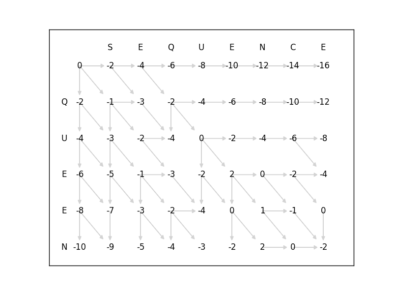
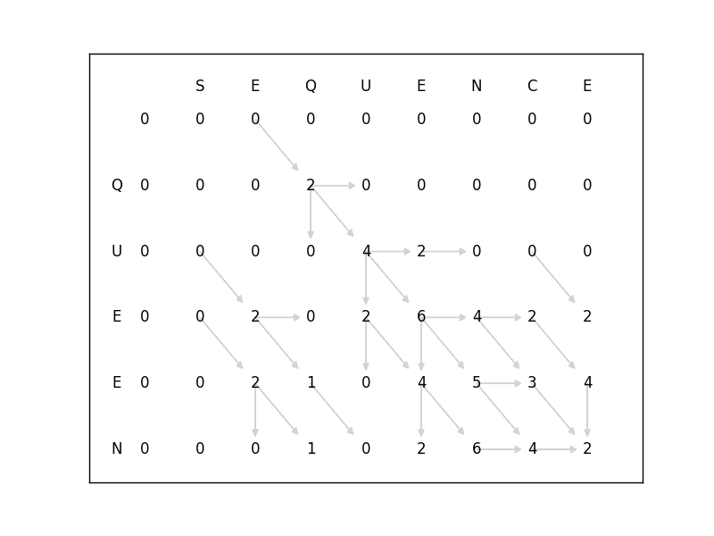

# Sequence Alignment
Script to align sequences

	$ python align.py -h
	usage: align.py [-h] [-l] s t

	Given two sequences, find the optimal global or local alignments. Returns the
	alignment scores, optimal alignments, and dynamic programming table. (Scoring:
	match = 2, mismatch = -1, indel = -2).

	positional arguments:
	  s           A string
	  t           Another string

	optional arguments:
	  -h, --help  show this help message and exit
	  -l          if specified, find optimal local alignment (default=global)
	  
# Requirements
Python 3.5

# Example 1
	$ python align.py sequence queen

	Given sequences "sequence" and "queen"
	Global alignment returns a score of -2

	The optimal alignments are:
	sequence
	--que-en

	sequence
	--quee-n

	sequence
	--queen-

	sequ-ence
	--queen--

	seque-nce
	--queen--

	sequence-
	--que--en

# Example 2
	$ python align.py sequence queen -l

	Given sequences "sequence" and "queen"
	Local alignment returns a max score of 6

	The optimal alignments are:
	que
	que

	qu-en
	queen

	que-n
	queen
	

